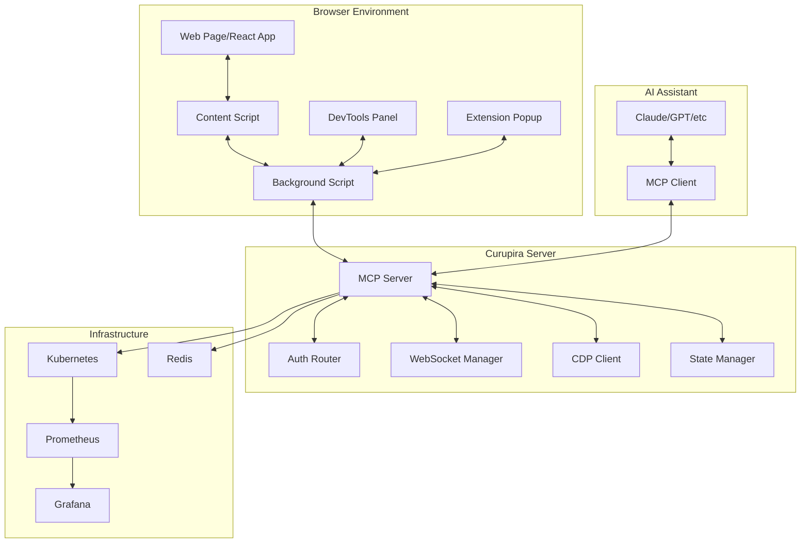

# Curupira Architecture Documentation

## Overview

Curupira is a comprehensive MCP (Model Context Protocol) debugging tool designed specifically for React applications. It enables AI assistants to seamlessly debug web applications by providing deep integration with browser DevTools, state management libraries, and performance monitoring capabilities.

The name "Curupira" comes from Brazilian folklore - a mythological protector who leaves backwards footprints to confuse hunters. Similarly, Curupira helps developers trace backwards through problems in their applications.

## High-Level System Architecture



## Component Architecture

### 1. Browser Extension Architecture

```
Chrome Extension (Manifest V3)
├── manifest.json
├── background/
│   └── service-worker.ts          # Background Script
├── content/
│   ├── content-script.ts          # Content Script
│   └── page-script.ts             # Injected Script
├── devtools/
│   ├── panel.html                 # DevTools Panel UI
│   ├── panel.ts                   # DevTools Logic
│   └── devtools.ts                # DevTools Entry
├── popup/
│   ├── popup.html                 # Extension Popup UI
│   └── popup.ts                   # Popup Logic
└── web-accessible-resources/
    └── bridge.js                  # Page Communication Bridge
```

#### Message Flow in Browser Extension

```
Page Context (React App)
    ↓ (window.postMessage)
Content Script
    ↓ (chrome.runtime.sendMessage)
Background Script (Service Worker)
    ↓ (WebSocket)
MCP Server
    ↓ (MCP Protocol)
AI Assistant
```

### 2. Server-Side Architecture

```
Curupira MCP Server
├── shared/                        # Shared utilities and types
│   ├── src/
│   │   ├── types/                 # Branded types and interfaces
│   │   ├── config/                # Configuration system
│   │   ├── logging/               # Structured logging
│   │   ├── errors/                # Error handling
│   │   └── utils/                 # Utility functions
│   └── package.json
├── mcp/                           # MCP Protocol Server
│   ├── src/
│   │   ├── server.ts              # Main MCP server
│   │   ├── protocol/              # MCP protocol implementation
│   │   ├── transport/             # WebSocket/HTTP transport
│   │   ├── resources/             # MCP resource handlers
│   │   ├── tools/                 # MCP tool handlers
│   │   ├── prompts/               # MCP prompt handlers
│   │   └── handlers/              # Protocol message handlers
│   └── package.json
├── auth/                          # Authentication system
│   ├── src/
│   │   ├── providers/             # JWT, OAuth providers
│   │   ├── middleware/            # Auth middleware
│   │   ├── repositories/          # User/session storage
│   │   └── types.ts               # Auth types
│   └── package.json
├── integration/                   # Browser integration
│   ├── src/
│   │   ├── cdp/                   # Chrome DevTools Protocol
│   │   ├── websocket/             # WebSocket management
│   │   ├── routing/               # Message routing
│   │   ├── storage/               # Storage abstraction
│   │   ├── state/                 # State management integration
│   │   ├── debugger/              # Time-travel debugger
│   │   └── profiler/              # Performance profiler
│   └── package.json
├── chrome-extension/              # Browser extension
└── e2e/                          # End-to-end tests
```

## Data Flow Architecture

### 1. MCP Protocol Communication Flow

```
AI Assistant
    ↓ JSON-RPC 2.0 over WebSocket
    ├── initialize
    ├── resources/list
    ├── resources/read
    ├── tools/list
    ├── tools/call
    ├── prompts/list
    └── prompts/get
                ↓
MCP Server
    ↓ Chrome DevTools Protocol
Browser Tab
    ↓ JavaScript Evaluation
React Application
```

### 2. Debugging Session Flow

```
1. AI Assistant Request
   ├── "Debug this React component"
   └── MCP tools/call → "navigate" | "evaluate" | "screenshot"

2. MCP Server Processing
   ├── Parse request parameters
   ├── Authenticate & authorize
   ├── Route to appropriate handler
   └── Execute browser action via CDP

3. Browser Execution
   ├── Navigate to URL
   ├── Evaluate JavaScript
   ├── Capture DOM state
   ├── Monitor network requests
   └── Extract React component tree

4. Response Assembly
   ├── Sanitize sensitive data
   ├── Format for MCP protocol
   ├── Add metadata & context
   └── Return structured response

5. AI Assistant Processing
   ├── Parse debugging data
   ├── Analyze patterns & issues
   ├── Generate insights
   └── Provide actionable recommendations
```

### 3. State Management Integration Flow

```
React Application State Changes
    ↓
State Management Libraries
├── React DevTools Hook
├── XState Inspector
├── Zustand DevTools
└── Apollo Client DevTools
    ↓
Content Script Monitoring
    ↓ (Real-time events)
Background Script Aggregation
    ↓ (WebSocket)
MCP Server State Tracking
    ↓ (Time-travel snapshots)
AI Assistant Analysis
```

## Technical Architecture Details

### 1. Authentication & Authorization Architecture

```
Request Flow:
┌─────────────┐    JWT Token    ┌──────────────┐
│   Client    │ ──────────────> │ Auth         │
│ (Extension/ │                 │ Middleware   │
│ AI Tool)    │ <────────────── │              │
└─────────────┘   Auth Context  └──────────────┘
                                       │
                                       ↓
                              ┌──────────────┐
                              │ Permission   │
                              │ Check        │
                              └──────────────┘
                                       │
                                       ↓
                              ┌──────────────┐
                              │ MCP Handler  │
                              │ Execution    │
                              └──────────────┘

User Roles & Permissions:
├── Admin
│   ├── read:users, write:users
│   ├── read:sessions, write:sessions
│   ├── read:debug, write:debug
│   └── admin:system
├── Developer
│   ├── read:profile
│   ├── read:debug
│   └── write:debug
└── Readonly
    ├── read:profile
    └── read:debug
```

### 2. WebSocket Connection Management

```
Connection Lifecycle:
┌─────────────┐
│ Client      │
│ Connect     │
└─────────────┘
       │
       ↓ WebSocket Handshake
┌─────────────┐
│ Auth Check  │
│ & Session   │
│ Creation    │
└─────────────┘
       │
       ↓ Success
┌─────────────┐    Heartbeat    ┌─────────────┐
│ Active      │ <────────────── │ Connection  │
│ Connection  │ ──────────────> │ Pool        │
│ Monitoring  │    30s pulse    │ Manager     │
└─────────────┘                 └─────────────┘
       │                               │
       ↓ Timeout/Error                 ↓ Auto-cleanup
┌─────────────┐                 ┌─────────────┐
│ Reconnection│                 │ Idle        │
│ with        │                 │ Connection  │
│ Backoff     │                 │ Removal     │
└─────────────┘                 └─────────────┘
```

### 3. Message Routing Architecture

```
Message Router (Event-Driven)
├── Input Sources
│   ├── WebSocket connections
│   ├── HTTP requests
│   ├── CDP events
│   └── Internal events
├── Routing Engine
│   ├── Source matching
│   ├── Message type filtering
│   ├── Priority-based queuing
│   └── Transform pipeline
├── Transform Pipeline
│   ├── Authentication check
│   ├── Data sanitization
│   ├── Format conversion
│   ├── Enrichment (metadata)
│   └── Compression
└── Output Destinations
    ├── MCP protocol handlers
    ├── CDP command dispatch
    ├── Storage operations
    └── Event notifications

Message Transformation:
Raw Browser Event → Sanitization → MCP Format → AI Assistant
CDP Response ← Format Conversion ← MCP Response ← AI Request
```

### 4. Storage Architecture

```
Storage Abstraction Layer
├── Interface (StorageStore)
│   ├── get(key) → Promise<T | null>
│   ├── set(key, value, ttl?) → Promise<void>
│   ├── delete(key) → Promise<boolean>
│   ├── clear() → Promise<void>
│   └── keys(pattern?) → Promise<string[]>
├── Implementations
│   ├── MemoryStore (development)
│   ├── FileStore (local persistence)
│   └── RedisStore (production)
├── Features
│   ├── Namespacing (multi-tenant)
│   ├── TTL expiration
│   ├── LRU/LFU/FIFO caching
│   └── Event notifications
└── Usage Patterns
    ├── Session storage
    ├── Debug snapshots
    ├── Performance metrics
    └── Configuration cache
```

### 5. Performance Profiling Architecture

```
Performance Monitoring Pipeline
├── Data Collection
│   ├── React Profiler API
│   ├── Performance Observer API
│   ├── Chrome DevTools Performance
│   ├── Network Resource Timing
│   └── Memory Usage Monitoring
├── Real-time Analysis
│   ├── Render performance tracking
│   ├── Memory leak detection
│   ├── Network bottleneck identification
│   └── Core Web Vitals monitoring
├── Issue Detection
│   ├── Slow render detection (>16ms)
│   ├── Memory growth monitoring
│   ├── Network timeout tracking
│   └── Layout shift measurement
├── Alerting & Reporting
│   ├── Performance issue notifications
│   ├── Optimization suggestions
│   ├── Trend analysis
│   └── Comparative benchmarks
└── AI Integration
    ├── Performance pattern analysis
    ├── Automated optimization suggestions
    ├── Root cause identification
    └── Proactive issue prevention
```

## Deployment Architecture

### 1. Kubernetes Deployment

```
Kubernetes Cluster
├── Namespace: tools
├── Deployments
│   └── curupira-mcp-server
│       ├── Replicas: 2 (min) - 10 (max)
│       ├── Rolling Update Strategy
│       ├── Resource Limits: 500m CPU, 512Mi Memory
│       └── Health Checks (liveness, readiness, startup)
├── Services
│   ├── curupira-mcp-server (LoadBalancer)
│   │   ├── HTTP: 80 → 3000
│   │   └── WebSocket: 8080 → 8080
│   └── curupira-mcp-server-metrics (ClusterIP)
│       └── Metrics: 3001 → 3001
├── ConfigMaps & Secrets
│   ├── curupira-config (CORS, rate limits)
│   └── curupira-secrets (JWT, Redis URL)
├── Scaling & Availability
│   ├── HorizontalPodAutoscaler (CPU: 70%, Memory: 80%)
│   ├── PodDisruptionBudget (maxUnavailable: 1)
│   └── NetworkPolicy (security isolation)
└── Monitoring Integration
    ├── ServiceMonitor (Prometheus)
    ├── PrometheusRules (alerting)
    └── Grafana Dashboard
```

### 2. Monitoring & Observability Stack

```
Observability Pipeline
├── Metrics Collection
│   ├── Application Metrics
│   │   ├── WebSocket connections
│   │   ├── MCP request/response times
│   │   ├── Debug session counts
│   │   └── Time-travel operations
│   ├── Infrastructure Metrics
│   │   ├── CPU/Memory usage
│   │   ├── Network I/O
│   │   └── Disk usage
│   └── Business Metrics
│       ├── Active users
│       ├── Debug sessions per hour
│       └── Error rates by component
├── Alerting Rules
│   ├── Critical Alerts
│   │   ├── Service down (1min threshold)
│   │   ├── High error rate (>5% for 2min)
│   │   └── High memory usage (>85% for 5min)
│   ├── Warning Alerts
│   │   ├── High latency (>500ms p95 for 2min)
│   │   ├── High WebSocket connections (>800)
│   │   └── Slow time-travel ops (>2s p95)
│   └── Info Alerts
│       └── High debug session count (>50)
├── Dashboards
│   ├── Overview Dashboard
│   │   ├── Request rate & response time
│   │   ├── WebSocket connection count
│   │   ├── Error rate trends
│   │   └── Resource utilization
│   ├── Performance Dashboard
│   │   ├── Time-travel operation metrics
│   │   ├── Debug session lifecycle
│   │   ├── Memory usage patterns
│   │   └── Network request profiling
│   └── Infrastructure Dashboard
│       ├── Pod resource usage
│       ├── Kubernetes cluster health
│       └── Storage utilization
└── Distributed Tracing (Future)
    ├── Request correlation across services
    ├── Performance bottleneck identification
    └── Error propagation tracking
```

## Security Architecture

### 1. Multi-Layer Security Model

```
Security Layers (Defense in Depth)
├── Network Security
│   ├── Kubernetes NetworkPolicy
│   ├── TLS/WSS encryption
│   ├── CORS policy enforcement
│   └── Rate limiting per IP/user
├── Authentication & Authorization
│   ├── JWT with short expiration (15min)
│   ├── Refresh token rotation
│   ├── OAuth2 integration (Google, GitHub)
│   ├── Role-based permissions
│   └── API key management
├── Application Security
│   ├── Input validation & sanitization
│   ├── XSS prevention
│   ├── CSRF protection
│   ├── SQL injection prevention
│   └── Secure headers (Helmet.js)
├── Data Security
│   ├── PII detection & redaction
│   ├── Sensitive data masking
│   ├── Encrypted storage
│   └── Audit logging
└── Infrastructure Security
    ├── Non-root container execution
    ├── Read-only root filesystem
    ├── Security context constraints
    ├── Resource quotas & limits
    └── Pod security standards
```

### 2. Data Sanitization Pipeline

```
Data Sanitization Flow
├── Input Stage
│   ├── Browser console logs
│   ├── Network request/response data
│   ├── DOM element content
│   └── JavaScript evaluation results
├── Detection Stage
│   ├── PII pattern matching (emails, phones, SSNs)
│   ├── Authentication token detection
│   ├── Credit card number identification
│   ├── API key pattern recognition
│   └── Custom sensitive data rules
├── Sanitization Stage
│   ├── Replace with placeholders
│   ├── Hash sensitive values
│   ├── Truncate long values
│   └── Remove entirely if necessary
├── Validation Stage
│   ├── Verify no sensitive data remains
│   ├── Check data structure integrity
│   └── Ensure MCP protocol compliance
└── Output Stage
    ├── Clean data to AI assistant
    ├── Sanitization audit log
    └── Security metrics update
```

## Extension Integration Architecture

### 1. Chrome Extension Communication

```
Multi-Context Communication
├── Page Context (Isolated World)
│   ├── React DevTools Hook injection
│   ├── State management library hooks
│   ├── Performance API monitoring
│   └── Custom event dispatching
├── Content Script Context (Extension)
│   ├── DOM manipulation capabilities
│   ├── Page script injection
│   ├── Message relay to background
│   └── Security boundary enforcement
├── Background Context (Service Worker)
│   ├── WebSocket connection to MCP server
│   ├── Message routing & queueing
│   ├── Extension state management
│   ├── Chrome APIs access
│   └── Lifecycle management
└── DevTools Context (Extension)
    ├── Custom debugging panel
    ├── Real-time data visualization
    ├── Tool execution interface
    └── Connection status monitoring

Message Security & Validation:
Page → Content Script: postMessage with origin validation
Content → Background: chrome.runtime.sendMessage with auth
Background → Server: WebSocket with JWT authentication
Server → Background: MCP protocol with data sanitization
```

### 2. DevTools Integration

```
DevTools Panel Architecture
├── Panel Registration
│   ├── chrome.devtools.panels.create()
│   ├── Panel icon & title configuration
│   └── Panel HTML & script injection
├── Panel Components
│   ├── Connection Status Widget
│   │   ├── WebSocket connection state
│   │   ├── MCP server health status
│   │   └── Authentication status
│   ├── Console Log Viewer
│   │   ├── Real-time log streaming
│   │   ├── Log level filtering
│   │   ├── Search & highlighting
│   │   └── Export functionality
│   ├── Network Request Monitor
│   │   ├── HTTP request tracking
│   │   ├── Response time analysis
│   │   ├── Error identification
│   │   └── GraphQL query optimization
│   ├── State Tree Visualizer
│   │   ├── React component hierarchy
│   │   ├── Props & state inspection
│   │   ├── State change timeline
│   │   └── Component performance profiling
│   └── Tool Execution Interface
│       ├── Navigation controls
│       ├── JavaScript evaluation
│       ├── Screenshot capture
│       └── Debugging tool shortcuts
├── Real-time Updates
│   ├── WebSocket event subscription
│   ├── Efficient DOM updates
│   ├── Memory management
│   └── Performance optimization
└── Data Export & Import
    ├── Debug session export
    ├── Performance report generation
    ├── Configuration backup/restore
    └── Integration with external tools
```

## AI Integration Architecture

### 1. MCP Protocol Implementation

```
MCP Server Capabilities
├── Protocol Version: 2024-11-05
├── Server Info
│   ├── Name: "curupira-mcp-server"
│   ├── Version: "1.0.0"
│   └── Description: "React debugging MCP server"
├── Supported Operations
│   ├── resources/* (browser data access)
│   ├── tools/* (browser action execution)
│   ├── prompts/* (debugging templates)
│   └── notifications/* (real-time updates)
└── Resource Categories
    ├── Browser Resources
    │   ├── curupira://browser/console
    │   ├── curupira://browser/network
    │   ├── curupira://browser/dom
    │   ├── curupira://browser/storage
    │   └── curupira://browser/performance
    ├── State Resources
    │   ├── curupira://state/react
    │   ├── curupira://state/xstate
    │   ├── curupira://state/zustand
    │   └── curupira://state/apollo
    ├── Debug Resources
    │   ├── curupira://debug/snapshots
    │   ├── curupira://debug/timeline
    │   └── curupira://debug/sessions
    └── Performance Resources
        ├── curupira://perf/metrics
        ├── curupira://perf/issues
        └── curupira://perf/profiling
```

### 2. AI Assistant Integration Flow

```
AI Debugging Session Flow
├── Session Initialization
│   ├── AI connects via MCP protocol
│   ├── Authentication & capability negotiation
│   ├── Browser tab targeting
│   └── Initial state capture
├── Problem Analysis Phase
│   ├── Console error examination
│   ├── Network request analysis
│   ├── Component state inspection
│   ├── Performance metric review
│   └── Historical data correlation
├── Hypothesis Generation
│   ├── Error pattern matching
│   ├── State mutation analysis
│   ├── Performance bottleneck identification
│   ├── Integration with knowledge base
│   └── Confidence scoring
├── Interactive Debugging
│   ├── Targeted data collection
│   ├── Hypothesis testing
│   ├── Code evaluation & experimentation
│   ├── Time-travel debugging
│   └── Real-time monitoring
├── Solution Development
│   ├── Root cause identification
│   ├── Fix recommendations
│   ├── Code change suggestions
│   ├── Testing strategy
│   └── Prevention measures
└── Documentation & Learning
    ├── Session summary generation
    ├── Knowledge base updates
    ├── Pattern library enhancement
    └── Debugging playbook creation
```

## Scalability & Performance

### 1. Horizontal Scaling Strategy

```
Scaling Architecture
├── Stateless MCP Server Design
│   ├── No server-side session state
│   ├── JWT-based authentication
│   ├── External storage for persistence
│   └── Load balancer compatible
├── Connection Management
│   ├── WebSocket connection pooling
│   ├── Connection health monitoring
│   ├── Automatic failover
│   └── Graceful shutdown handling
├── Resource Management
│   ├── Memory usage optimization
│   ├── CPU-bound task queuing
│   ├── I/O operation batching
│   └── Connection rate limiting
├── Caching Strategy
│   ├── Redis-based session caching
│   ├── Debug snapshot caching
│   ├── Performance metrics caching
│   └── Configuration caching
└── Auto-Scaling Configuration
    ├── CPU threshold: 70%
    ├── Memory threshold: 80%
    ├── Min replicas: 2
    ├── Max replicas: 10
    └── Scale-down stabilization: 5min
```

### 2. Performance Optimization

```
Performance Optimization Stack
├── Protocol Level
│   ├── WebSocket connection reuse
│   ├── Message batching
│   ├── Compression (gzip)
│   └── Binary protocol consideration
├── Application Level
│   ├── Async/await optimization
│   ├── Event loop monitoring
│   ├── Memory leak prevention
│   ├── CPU profiling integration
│   └── Database query optimization
├── Infrastructure Level
│   ├── Container resource tuning
│   ├── Network policy optimization
│   ├── Storage I/O optimization
│   └── Load balancer configuration
├── Monitoring & Alerting
│   ├── Real-time performance metrics
│   ├── SLO/SLI definition & tracking
│   ├── Performance regression detection
│   └── Capacity planning automation
└── Continuous Optimization
    ├── Performance testing automation
    ├── Load testing in CI/CD
    ├── Performance budget enforcement
    └── Regular performance reviews
```

## Development & Testing Architecture

### 1. Development Workflow

```
Development Pipeline
├── Local Development
│   ├── Hot reload for all components
│   ├── Local MCP server with auth disabled
│   ├── Chrome extension development mode
│   ├── Mock data for rapid iteration
│   └── Integrated debugging tools
├── Code Quality Gates
│   ├── TypeScript strict mode
│   ├── ESLint + Prettier
│   ├── Unit test coverage (>80%)
│   ├── Integration test suite
│   └── E2E test automation
├── CI/CD Pipeline
│   ├── Automated testing on PR
│   ├── Docker image building
│   ├── Security vulnerability scanning
│   ├── Performance regression testing
│   └── Deployment automation
└── Release Management
    ├── Semantic versioning
    ├── Automated changelog generation
    ├── Staged deployment (dev → staging → prod)
    └── Rollback capability
```

### 2. Testing Strategy

```
Testing Pyramid
├── Unit Tests (Fast, Isolated)
│   ├── Pure function testing
│   ├── Component testing (React Testing Library)
│   ├── Service testing (mocked dependencies)
│   ├── Utility function testing
│   └── Type testing (compilation)
├── Integration Tests (Component Interaction)
│   ├── API endpoint testing
│   ├── WebSocket communication testing
│   ├── Database integration testing
│   ├── Authentication flow testing
│   └── MCP protocol testing
├── E2E Tests (Full System)
│   ├── Browser automation (Playwright)
│   ├── Chrome extension testing
│   ├── Multi-tab debugging scenarios
│   ├── Performance profiling workflows
│   └── User journey validation
└── Specialized Testing
    ├── Security testing (OWASP)
    ├── Performance testing (load & stress)
    ├── Accessibility testing (a11y)
    ├── Cross-browser compatibility
    └── Mobile responsiveness
```

## Future Architecture Considerations

### 1. Extensibility & Plugins

```
Plugin Architecture (Future)
├── Plugin API
│   ├── Custom resource handlers
│   ├── Tool extensions
│   ├── Prompt templates
│   └── UI component injection
├── Third-party Integrations
│   ├── Sentry error tracking
│   ├── LogRocket session replay
│   ├── New Relic APM
│   └── Custom analytics platforms
├── Framework Support
│   ├── Vue.js DevTools integration
│   ├── Angular debugging support
│   ├── Svelte state inspection
│   └── Next.js optimization tools
└── Marketplace Ecosystem
    ├── Community plugin repository
    ├── Plugin validation & security
    ├── Versioning & compatibility
    └── Documentation & examples
```

### 2. AI Enhancement Opportunities

```
AI/ML Integration Roadmap
├── Predictive Debugging
│   ├── Error prediction based on patterns
│   ├── Performance regression forecasting
│   ├── Proactive optimization suggestions
│   └── Automated fix recommendations
├── Intelligent Code Analysis
│   ├── Code smell detection
│   ├── Anti-pattern identification
│   ├── Security vulnerability scanning
│   └── Performance optimization hints
├── Natural Language Processing
│   ├── Error message interpretation
│   ├── Stack trace analysis
│   ├── Code comment understanding
│   └── Documentation generation
└── Machine Learning Models
    ├── User behavior analysis
    ├── Debugging pattern recognition
    ├── Performance anomaly detection
    └── Automated test generation
```

---

## Summary

Curupira represents a comprehensive, production-ready architecture for AI-assisted React debugging. The system combines:

- **Robust MCP protocol implementation** for seamless AI integration
- **Deep browser integration** through Chrome extensions and DevTools Protocol
- **Advanced debugging capabilities** including time-travel and performance profiling
- **Production-grade infrastructure** with Kubernetes, monitoring, and security
- **Extensible architecture** ready for future enhancements

The architecture follows best practices for scalability, security, and maintainability while providing a rich debugging experience that helps developers trace backwards through problems in their React applications, just like the mythological Curupira's backwards footprints.

