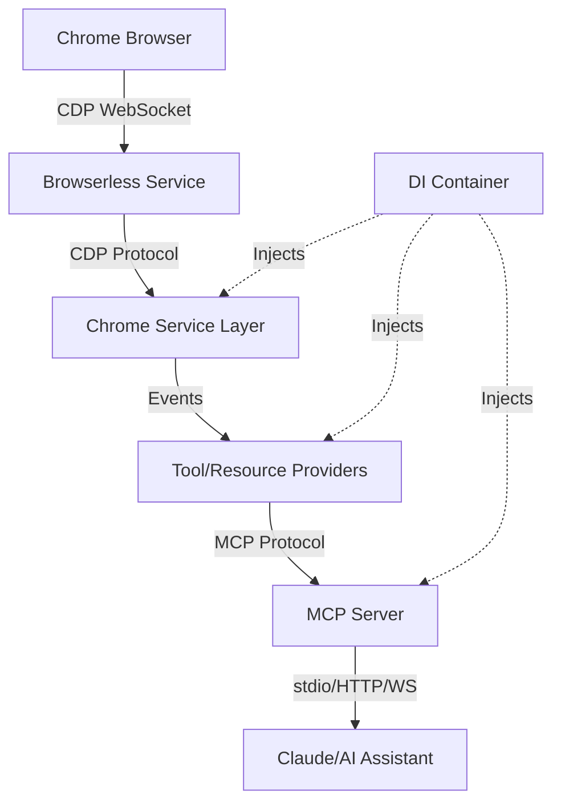

# Curupira - MCP Frontend Debugging Tool

<div align="center">
  <h3>🦶 Trace backwards through execution to find the root cause 🦶</h3>
  <p>Named after the Brazilian forest guardian with backward feet</p>
  
  [](https://opensource.org/licenses/MIT)
  [](https://hub.docker.com/r/drzln/curupira)
  [](https://www.npmjs.com/package/curupira)
  [](CONTRIBUTING.md)
</div>

## Overview

Curupira is a Model Context Protocol (MCP) debugging tool that provides AI assistants with direct access to browser DevTools, React state, and runtime debugging capabilities. It bridges the gap between AI assistants and complex frontend applications through Chrome DevTools Protocol.

### Key Features

- 🔍 **Chrome DevTools Protocol Integration**: Full access to CDP domains (Runtime, Debugger, Network, DOM, etc.)
- ⚛️ **React Application Debugging**: Component inspection, props/state analysis, hooks debugging
- 🎯 **State Management**: Apollo GraphQL, Zustand stores, XState machines, TanStack Query
- 🛠️ **Framework Support**: React Router, Framer Motion, React Hook Form, Vite, Panda CSS
- 🚀 **Multiple Transports**: WebSocket, HTTP/SSE, and stdio for different deployment scenarios
- 📦 **Dependency Injection**: Clean architecture with comprehensive DI container
- 🤖 **AI-Optimized**: Built specifically for AI assistant interaction via MCP

## 📚 Documentation

- [API Documentation](./docs/API.md) - Complete API reference for all resources, tools, and prompts
- [Usage Examples](./docs/EXAMPLES.md) - Common debugging scenarios and integration examples
- [Troubleshooting Guide](./docs/TROUBLESHOOTING.md) - Solutions for common issues
- [Development Specification](./CURUPIRA_ENHANCED_SPEC.md) - Technical implementation details

## Quick Start

### Using Docker with Browserless

```bash
# Start Browserless Chrome service
docker run -d -p 3000:3000 --name browserless browserless/chrome

# Start Curupira MCP server
docker run -p 8080:8080 -e CHROME_SERVICE_URL=http://host.docker.internal:3000 drzln/curupira:latest
```

### Using npm

```bash
# Install globally
npm install -g curupira

# Start with default configuration
curupira start

# Or specify a custom config
curupira start --config ./config/production.yaml
```

### From Source

```bash
# Clone the repository
git clone https://github.com/pleme-io/nexus.git
cd nexus/pkgs/services/typescript/curupira

# Install dependencies
npm install

# Build the project
npm run build

# Start the MCP server
npm run start

# Or run in development mode with hot reload
npm run dev
```

### Claude Code Integration

Add to your `claude_desktop_config.json`:

```json
{
  "mcpServers": {
    "curupira": {
      "command": "node",
      "args": ["/path/to/curupira/mcp-server/dist/main.js"],
      "env": {
        "CHROME_SERVICE_URL": "http://localhost:3000",
        "LOGGING_LEVEL": "info"
      }
    }
  }
}
```

## Architecture

Curupira follows a clean architecture with dependency injection:



### Architectural Layers

1. **Foundation Layer** - Branded types, interfaces, error definitions
2. **Core Services** - Chrome service, buffer services, validators
3. **MCP Layer** - Tool/resource providers, protocol handlers
4. **Application Layer** - Server bootstrap, DI container, transport management

### Key Components

- **Chrome Service**: Manages CDP connections with event-driven architecture
- **Tool Registry**: Dynamic tool registration with factory pattern
- **Resource Registry**: Provides browser state as MCP resources
- **DI Container**: Manages dependencies and service lifecycle

## Installation

### Prerequisites

- Node.js 20+ LTS
- npm 10+
- Chrome/Chromium browser
- Docker (optional)

### Chrome Extension Setup

1. Clone the repository
2. Build the extension: `npm run build:extension`
3. Open Chrome and navigate to `chrome://extensions/`
4. Enable "Developer mode"
5. Click "Load unpacked" and select `chrome-extension/dist`

### Server Setup

```bash
# Using npm scripts
npm run dev:server

# Using Docker
docker-compose up -d

# Using Kubernetes
kubectl apply -f k8s/
```

## Usage Examples

### Debug Lazy-Loaded Icons

```typescript
// AI Assistant can request:
await mcp.runTool('inspect', {
  component: 'Icon',
  props: { name: 'pigeon', lazy: true }
})
```

### Analyze GraphQL Errors

```typescript
// AI Assistant can request:
await mcp.runTool('analyzeGraphQL', {
  operation: 'GetProducts',
  error: "cannot query field 'products' on type 'Product'"
})
```

### Time Travel Debugging

```typescript
// AI Assistant can request:
const recording = await mcp.runTool('timeTravel', {
  store: 'cart',
  duration: 30000
})
```

## MCP Resources & Tools

### Available Resources

- `console` - Browser console logs and errors
- `network` - HTTP requests and responses
- `dom` - DOM tree and element inspection
- `react` - React component tree and state
- `state` - Application state management

### Available Tools

- `inspect` - Inspect components and elements
- `evaluate` - Execute code in page context
- `debug` - Set breakpoints and step through code
- `profile` - Performance profiling
- `timeTravel` - Record and replay state changes

## Configuration

Create a `.env` file based on `.env.example`:

```bash
# Server Configuration
CURUPIRA_PORT=8080
CURUPIRA_HOST=localhost
CURUPIRA_LOG_LEVEL=debug

# WebSocket Configuration
CURUPIRA_WS_URL=ws://localhost:8080/mcp

# Authentication (optional)
CURUPIRA_AUTH_ENABLED=false
CURUPIRA_JWT_SECRET=your-secret-here
```

## Docker Support

### Build Image

```bash
docker build -t curupira:latest .
```

### Run Container

```bash
docker run -p 8080:8080 \
  -e CURUPIRA_LOG_LEVEL=info \
  curupira:latest
```

### Docker Compose

```bash
docker-compose up -d
```

## Development

### Project Structure

```
curupira/
├── chrome-extension/   # Browser extension
├── mcp-server/        # MCP protocol server
├── shared/            # Shared utilities
├── docs/              # Documentation
├── k8s/               # Kubernetes configs
└── scripts/           # Build scripts
```

### NPM Scripts

```bash
# Development
npm run dev              # Start all services
npm run dev:server       # Start MCP server only
npm run dev:extension    # Build extension (watch)

# Building
npm run build           # Build all packages
npm run build:docker    # Build Docker image

# Testing
npm run test           # Run all tests
npm run test:watch     # Run tests (watch)
npm run test:coverage  # Generate coverage

# Code Quality
npm run lint          # Lint and fix
npm run format        # Format code
npm run type-check    # Check types
```

### Testing

```bash
# Unit tests
npm run test:unit

# Integration tests
npm run test:integration

# E2E tests
npm run test:e2e
```

## Contributing

We welcome contributions! Please see our [Contributing Guide](CONTRIBUTING.md) for details.

### Development Setup

1. Fork the repository
2. Create your feature branch (`git checkout -b feature/amazing-feature`)
3. Commit your changes (`git commit -m 'Add amazing feature'`)
4. Push to the branch (`git push origin feature/amazing-feature`)
5. Open a Pull Request

## Security

For security issues, please email security@pleme.io instead of using the issue tracker.

## Publishing

### For Maintainers

To release a new version:

```bash
# Bump version (patch, minor, or major)
./scripts/version.sh patch

# Push changes and tag
git push origin main
git push origin v1.0.1

# Publish to npm and Docker Hub
./scripts/publish.sh
```

## License

This project is licensed under the MIT License - see the [LICENSE](LICENSE) file for details.

## Acknowledgments

- Built on the [Model Context Protocol](https://modelcontextprotocol.io/) specification
- Inspired by Chrome DevTools and React DevTools
- Named after the [Curupira](https://en.wikipedia.org/wiki/Curupira) from Brazilian folklore

## Links

- [Documentation](https://github.com/drzln/curupira/wiki)
- [npm Package](https://www.npmjs.com/package/curupira)
- [Docker Hub](https://hub.docker.com/r/drzln/curupira)
- [Issue Tracker](https://github.com/drzln/curupira/issues)

---

<div align="center">
  <p><em>Like its mythological namesake, Curupira helps you trace backwards through execution to find where problems began.</em></p>
  <p>Made with ❤️ by the Pleme.io team</p>
</div>