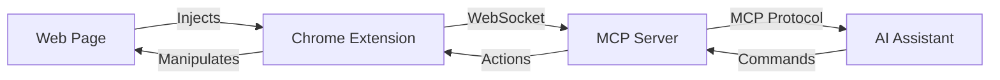

# Curupira - MCP Frontend Debugging Tool

<div align="center">
  <h3>🦶 Trace backwards through execution to find the root cause 🦶</h3>
  <p>Named after the Brazilian forest guardian with backward feet</p>
  
  [](https://opensource.org/licenses/MIT)
  [](https://hub.docker.com/r/drzln/curupira)
  [](https://www.npmjs.com/package/curupira)
  [](CONTRIBUTING.md)
</div>

## Overview

Curupira is a Model Context Protocol (MCP) debugging tool that provides AI assistants with direct access to browser DevTools, React state, and runtime debugging capabilities. It bridges the gap between AI assistants and complex frontend applications, enabling autonomous debugging and issue resolution.

### Key Features

- 🔍 **Browser DevTools Integration**: Console logs, network monitoring, DOM inspection
- ⚛️ **React DevTools Access**: Component state, props, render tracking  
- 🎯 **State Management**: XState machines, Zustand stores, Apollo cache
- 🐛 **Runtime Debugging**: Breakpoints, expression evaluation, time travel
- 🚀 **Real-time Communication**: WebSocket-based bidirectional data flow
- 🤖 **AI-Optimized**: Built specifically for AI assistant interaction via MCP

## Quick Start

### Using Docker

```bash
docker run -p 8080:8080 drzln/curupira:latest
```

### Using npm

```bash
# Install globally
npm install -g curupira

# Start the server
curupira start
```

### From Source

```bash
# Clone the repository
git clone https://github.com/drzln/curupira.git
cd curupira

# Install dependencies
npm install

# Start development servers
npm run dev

# Load Chrome extension
# Chrome > Extensions > Load unpacked > Select: chrome-extension/dist
```

## Architecture

Curupira consists of three main components:



1. **Chrome Extension** - Injects debugging hooks into web applications
2. **MCP Server** - Implements the Model Context Protocol specification
3. **Shared Libraries** - Common types and utilities

## Installation

### Prerequisites

- Node.js 20+ LTS
- npm 10+
- Chrome/Chromium browser
- Docker (optional)

### Chrome Extension Setup

1. Clone the repository
2. Build the extension: `npm run build:extension`
3. Open Chrome and navigate to `chrome://extensions/`
4. Enable "Developer mode"
5. Click "Load unpacked" and select `chrome-extension/dist`

### Server Setup

```bash
# Using npm scripts
npm run dev:server

# Using Docker
docker-compose up -d

# Using Kubernetes
kubectl apply -f k8s/
```

## Usage Examples

### Debug Lazy-Loaded Icons

```typescript
// AI Assistant can request:
await mcp.runTool('inspect', {
  component: 'Icon',
  props: { name: 'pigeon', lazy: true }
})
```

### Analyze GraphQL Errors

```typescript
// AI Assistant can request:
await mcp.runTool('analyzeGraphQL', {
  operation: 'GetProducts',
  error: "cannot query field 'products' on type 'Product'"
})
```

### Time Travel Debugging

```typescript
// AI Assistant can request:
const recording = await mcp.runTool('timeTravel', {
  store: 'cart',
  duration: 30000
})
```

## MCP Resources & Tools

### Available Resources

- `console` - Browser console logs and errors
- `network` - HTTP requests and responses
- `dom` - DOM tree and element inspection
- `react` - React component tree and state
- `state` - Application state management

### Available Tools

- `inspect` - Inspect components and elements
- `evaluate` - Execute code in page context
- `debug` - Set breakpoints and step through code
- `profile` - Performance profiling
- `timeTravel` - Record and replay state changes

## Configuration

Create a `.env` file based on `.env.example`:

```bash
# Server Configuration
CURUPIRA_PORT=8080
CURUPIRA_HOST=localhost
CURUPIRA_LOG_LEVEL=debug

# WebSocket Configuration
CURUPIRA_WS_URL=ws://localhost:8080/mcp

# Authentication (optional)
CURUPIRA_AUTH_ENABLED=false
CURUPIRA_JWT_SECRET=your-secret-here
```

## Docker Support

### Build Image

```bash
docker build -t curupira:latest .
```

### Run Container

```bash
docker run -p 8080:8080 \
  -e CURUPIRA_LOG_LEVEL=info \
  curupira:latest
```

### Docker Compose

```bash
docker-compose up -d
```

## Development

### Project Structure

```
curupira/
├── chrome-extension/   # Browser extension
├── mcp-server/        # MCP protocol server
├── shared/            # Shared utilities
├── docs/              # Documentation
├── k8s/               # Kubernetes configs
└── scripts/           # Build scripts
```

### NPM Scripts

```bash
# Development
npm run dev              # Start all services
npm run dev:server       # Start MCP server only
npm run dev:extension    # Build extension (watch)

# Building
npm run build           # Build all packages
npm run build:docker    # Build Docker image

# Testing
npm run test           # Run all tests
npm run test:watch     # Run tests (watch)
npm run test:coverage  # Generate coverage

# Code Quality
npm run lint          # Lint and fix
npm run format        # Format code
npm run type-check    # Check types
```

### Testing

```bash
# Unit tests
npm run test:unit

# Integration tests
npm run test:integration

# E2E tests
npm run test:e2e
```

## Contributing

We welcome contributions! Please see our [Contributing Guide](CONTRIBUTING.md) for details.

### Development Setup

1. Fork the repository
2. Create your feature branch (`git checkout -b feature/amazing-feature`)
3. Commit your changes (`git commit -m 'Add amazing feature'`)
4. Push to the branch (`git push origin feature/amazing-feature`)
5. Open a Pull Request

## Security

For security issues, please email security@pleme.io instead of using the issue tracker.

## Publishing

### For Maintainers

To release a new version:

```bash
# Bump version (patch, minor, or major)
./scripts/version.sh patch

# Push changes and tag
git push origin main
git push origin v1.0.1

# Publish to npm and Docker Hub
./scripts/publish.sh
```

## License

This project is licensed under the MIT License - see the [LICENSE](LICENSE) file for details.

## Acknowledgments

- Built on the [Model Context Protocol](https://modelcontextprotocol.io/) specification
- Inspired by Chrome DevTools and React DevTools
- Named after the [Curupira](https://en.wikipedia.org/wiki/Curupira) from Brazilian folklore

## Links

- [Documentation](https://github.com/drzln/curupira/wiki)
- [npm Package](https://www.npmjs.com/package/curupira)
- [Docker Hub](https://hub.docker.com/r/drzln/curupira)
- [Issue Tracker](https://github.com/drzln/curupira/issues)

---

<div align="center">
  <p><em>Like its mythological namesake, Curupira helps you trace backwards through execution to find where problems began.</em></p>
  <p>Made with ❤️ by the Pleme.io team</p>
</div>