# Curupira Task Dependency Graph

## Dependency-Driven Development Structure

This document reorganizes the Curupira implementation tasks into a strict bottom-up dependency structure where each layer is fully tested and certified before building the next layer.

```mermaid
graph BT
    %% Level 0: Foundation (No Dependencies)
    L0_TYPES[L0.1: Shared Types & Interfaces]
    L0_CONFIG[L0.2: Configuration System]
    L0_LOGGING[L0.3: Logging & Telemetry]
    L0_ERRORS[L0.4: Error Types & Handling]
    
    %% Level 1: Core Infrastructure (Depends on L0)
    L1_TRANSPORT[L1.1: Transport Layer]
    L1_PROTOCOL[L1.2: MCP Protocol Core]
    L1_SERVER[L1.3: Fastify Server Core]
    L1_SECURITY[L1.4: Security Primitives]
    
    %% Level 2: Integration Layer (Depends on L0-L1)
    L2_WEBSOCKET[L2.1: WebSocket Handler]
    L2_CDP[L2.2: Chrome DevTools Protocol]
    L2_MESSAGES[L2.3: Message Bus System]
    L2_STORAGE[L2.4: State Storage Layer]
    
    %% Level 3: MCP Implementation (Depends on L0-L2)
    L3_RESOURCES[L3.1: MCP Resources]
    L3_TOOLS[L3.2: MCP Tools]
    L3_PROMPTS[L3.3: MCP Prompts]
    L3_HANDLERS[L3.4: Request Handlers]
    
    %% Level 4: Browser Integration (Depends on L0-L3)
    L4_EXTENSION[L4.1: Extension Core]
    L4_CONTENT[L4.2: Content Scripts]
    L4_DEVTOOLS[L4.3: DevTools Panel]
    L4_BRIDGE[L4.4: Page Bridge]
    
    %% Level 5: State Management (Depends on L0-L4)
    L5_REACT[L5.1: React Integration]
    L5_XSTATE[L5.2: XState Integration]
    L5_ZUSTAND[L5.3: Zustand Integration]
    L5_APOLLO[L5.4: Apollo Integration]
    
    %% Level 6: Advanced Features (Depends on L0-L5)
    L6_DEBUG[L6.1: Debugger Features]
    L6_PROFILE[L6.2: Profiler Features]
    L6_TIMETRAVEL[L6.3: Time Travel]
    L6_ANALYTICS[L6.4: Analytics]
    
    %% Level 7: Production Ready (Depends on L0-L6)
    L7_AUTH[L7.1: Authentication]
    L7_DEPLOY[L7.2: Deployment]
    L7_MONITOR[L7.3: Monitoring]
    L7_E2E[L7.4: E2E Testing]
    
    %% Dependencies
    L1_TRANSPORT --> L0_TYPES
    L1_TRANSPORT --> L0_ERRORS
    L1_PROTOCOL --> L0_TYPES
    L1_SERVER --> L0_CONFIG
    L1_SERVER --> L0_LOGGING
    L1_SECURITY --> L0_CONFIG
    
    L2_WEBSOCKET --> L1_TRANSPORT
    L2_WEBSOCKET --> L1_SERVER
    L2_CDP --> L1_PROTOCOL
    L2_MESSAGES --> L1_TRANSPORT
    L2_STORAGE --> L0_TYPES
    
    L3_RESOURCES --> L2_MESSAGES
    L3_RESOURCES --> L1_PROTOCOL
    L3_TOOLS --> L2_CDP
    L3_TOOLS --> L1_PROTOCOL
    L3_PROMPTS --> L1_PROTOCOL
    L3_HANDLERS --> L1_SERVER
    L3_HANDLERS --> L3_RESOURCES
    L3_HANDLERS --> L3_TOOLS
    
    L4_EXTENSION --> L0_TYPES
    L4_CONTENT --> L2_MESSAGES
    L4_DEVTOOLS --> L2_CDP
    L4_BRIDGE --> L4_CONTENT
    
    L5_REACT --> L4_BRIDGE
    L5_REACT --> L3_RESOURCES
    L5_XSTATE --> L4_BRIDGE
    L5_XSTATE --> L3_RESOURCES
    L5_ZUSTAND --> L4_BRIDGE
    L5_ZUSTAND --> L3_RESOURCES
    L5_APOLLO --> L4_BRIDGE
    L5_APOLLO --> L3_RESOURCES
    
    L6_DEBUG --> L3_TOOLS
    L6_DEBUG --> L2_CDP
    L6_PROFILE --> L3_TOOLS
    L6_PROFILE --> L5_REACT
    L6_TIMETRAVEL --> L2_STORAGE
    L6_TIMETRAVEL --> L5_XSTATE
    L6_TIMETRAVEL --> L5_ZUSTAND
    L6_ANALYTICS --> L3_RESOURCES
    
    L7_AUTH --> L1_SECURITY
    L7_AUTH --> L3_HANDLERS
    L7_DEPLOY --> L0_CONFIG
    L7_MONITOR --> L0_LOGGING
    L7_E2E --> L6_DEBUG
    L7_E2E --> L6_PROFILE
    L7_E2E --> L6_TIMETRAVEL
```



## Level-Based Implementation Order

### Level 0: Foundation Layer (No Dependencies)
**Goal**: Create rock-solid foundation types and utilities that everything else depends on.

#### L0.1: Shared Types & Interfaces (4 hours)
- Define all TypeScript types and interfaces
- Create branded types for type safety
- Define message types for IPC
- **Test**: Type inference tests, compile-time validation
- **Certification**: 100% type coverage, no any types

#### L0.2: Configuration System (3 hours)
- Environment-based configuration with Zod validation
- Support for dev/staging/prod environments
- Feature flags system
- **Test**: Config validation, environment switching
- **Certification**: All configs validated, no runtime errors

#### L0.3: Logging & Telemetry (3 hours)
- Structured logging with Pino
- Log levels and filtering
- Performance metrics collection
- **Test**: Log output formatting, performance overhead
- **Certification**: <1ms logging overhead, structured output

#### L0.4: Error Types & Handling (2 hours)
- Custom error types for each domain
- Error serialization for IPC
- Stack trace preservation
- **Test**: Error propagation, serialization
- **Certification**: All errors traceable, no data loss

### Level 1: Core Infrastructure
**Goal**: Build transport and protocol layers that enable communication.

#### L1.1: Transport Layer (6 hours)
- Abstract transport interface
- Message serialization/deserialization
- Connection lifecycle management
- **Dependencies**: L0.1 (types), L0.4 (errors)
- **Test**: Message integrity, reconnection logic
- **Certification**: 100% message delivery, graceful reconnects

#### L1.2: MCP Protocol Core (8 hours)
- JSON-RPC 2.0 implementation
- MCP protocol message handling
- Request/response correlation
- **Dependencies**: L0.1 (types)
- **Test**: Protocol compliance, edge cases
- **Certification**: Passes MCP protocol test suite

#### L1.3: Fastify Server Core (4 hours)
- Basic Fastify setup with plugins
- Health/ready endpoints
- Graceful shutdown
- **Dependencies**: L0.2 (config), L0.3 (logging)
- **Test**: Server lifecycle, concurrent requests
- **Certification**: <10ms response time, clean shutdown

#### L1.4: Security Primitives (4 hours)
- JWT token validation
- CORS configuration
- Rate limiting setup
- **Dependencies**: L0.2 (config)
- **Test**: Auth flows, rate limit behavior
- **Certification**: No auth bypass, rate limits enforced

### Level 2: Integration Layer
**Goal**: Connect external systems and establish communication channels.

#### L2.1: WebSocket Handler (6 hours)
- WebSocket upgrade handling
- Binary/text message support
- Heartbeat/ping-pong
- **Dependencies**: L1.1 (transport), L1.3 (server)
- **Test**: Connection stability, message ordering
- **Certification**: 99.9% uptime, ordered delivery

#### L2.2: Chrome DevTools Protocol (8 hours)
- CDP client implementation
- Domain management (Console, Network, etc.)
- Event subscription system
- **Dependencies**: L1.2 (protocol)
- **Test**: CDP command execution, event capture
- **Certification**: All CDP domains accessible

#### L2.3: Message Bus System (6 hours)
- Pub/sub for internal events
- Message routing between components
- Dead letter queue for failures
- **Dependencies**: L1.1 (transport)
- **Test**: Message routing, failure handling
- **Certification**: No message loss, proper routing

#### L2.4: State Storage Layer (4 hours)
- In-memory state management
- Circular buffer implementation
- State snapshots and diffs
- **Dependencies**: L0.1 (types)
- **Test**: Memory limits, snapshot accuracy
- **Certification**: <100MB memory, accurate diffs

### Level 3: MCP Implementation
**Goal**: Implement the actual MCP protocol resources and tools.

#### L3.1: MCP Resources (8 hours)
- Console log resources
- Network request resources
- DOM element resources
- State snapshot resources
- **Dependencies**: L2.3 (messages), L1.2 (protocol)
- **Test**: Resource retrieval, filtering
- **Certification**: All resources queryable

#### L3.2: MCP Tools (8 hours)
- Expression evaluation tool
- Element inspection tool
- Breakpoint management tool
- Performance profiling tool
- **Dependencies**: L2.2 (CDP), L1.2 (protocol)
- **Test**: Tool execution, result accuracy
- **Certification**: All tools functional

#### L3.3: MCP Prompts (4 hours)
- Debugging prompt templates
- Dynamic prompt generation
- Context injection
- **Dependencies**: L1.2 (protocol)
- **Test**: Prompt rendering, context substitution
- **Certification**: All prompts valid

#### L3.4: Request Handlers (6 hours)
- Route MCP requests to handlers
- Implement MCP server interface
- Error handling and recovery
- **Dependencies**: L1.3 (server), L3.1, L3.2
- **Test**: Request routing, error cases
- **Certification**: All requests handled

### Level 4: Browser Integration
**Goal**: Create the Chrome extension that bridges browser and MCP server.

#### L4.1: Extension Core (6 hours)
- Manifest v3 configuration
- Service worker setup
- Extension lifecycle
- **Dependencies**: L0.1 (types)
- **Test**: Extension installation, permissions
- **Certification**: Installs cleanly, proper permissions

#### L4.2: Content Scripts (8 hours)
- Script injection system
- Isolated world communication
- DOM access and monitoring
- **Dependencies**: L2.3 (messages)
- **Test**: Injection timing, message passing
- **Certification**: No page interference

#### L4.3: DevTools Panel (6 hours)
- Custom DevTools panel
- Panel UI and controls
- DevTools API integration
- **Dependencies**: L2.2 (CDP)
- **Test**: Panel creation, API access
- **Certification**: Panel shows in DevTools

#### L4.4: Page Bridge (8 hours)
- Bridge between page and extension
- Hook installation system
- State extraction logic
- **Dependencies**: L4.2 (content scripts)
- **Test**: Bridge communication, hook reliability
- **Certification**: Hooks capture all state

### Level 5: State Management Integration
**Goal**: Integrate with specific state management libraries.

#### L5.1: React Integration (8 hours)
- React DevTools hook integration
- Component tree traversal
- Props/state extraction
- Render tracking
- **Dependencies**: L4.4 (bridge), L3.1 (resources)
- **Test**: Component discovery, state accuracy
- **Certification**: All React state accessible

#### L5.2: XState Integration (6 hours)
- XState inspection API
- Actor discovery
- State machine visualization
- Event sending
- **Dependencies**: L4.4 (bridge), L3.1 (resources)
- **Test**: Machine discovery, event handling
- **Certification**: All actors trackable

#### L5.3: Zustand Integration (6 hours)
- Store discovery mechanism
- State extraction
- Action invocation
- Middleware support
- **Dependencies**: L4.4 (bridge), L3.1 (resources)
- **Test**: Store discovery, state updates
- **Certification**: All stores accessible

#### L5.4: Apollo Integration (6 hours)
- Cache inspection
- Query/mutation tracking
- Subscription monitoring
- Cache manipulation
- **Dependencies**: L4.4 (bridge), L3.1 (resources)
- **Test**: Cache access, query tracking
- **Certification**: Full Apollo visibility

### Level 6: Advanced Features
**Goal**: Build powerful debugging capabilities on top of the foundation.

#### L6.1: Debugger Features (8 hours)
- Breakpoint management
- Step debugging
- Call stack inspection
- Variable evaluation
- **Dependencies**: L3.2 (tools), L2.2 (CDP)
- **Test**: Breakpoint reliability, stepping
- **Certification**: Debugging works reliably

#### L6.2: Profiler Features (8 hours)
- Performance recording
- Flame graph generation
- Memory profiling
- React profiler integration
- **Dependencies**: L3.2 (tools), L5.1 (React)
- **Test**: Profile accuracy, overhead
- **Certification**: <5% performance impact

#### L6.3: Time Travel (8 hours)
- State recording system
- Replay mechanism
- Timeline navigation
- Export/import recordings
- **Dependencies**: L2.4 (storage), L5.2, L5.3
- **Test**: Recording fidelity, replay accuracy
- **Certification**: Perfect replay accuracy

#### L6.4: Analytics (4 hours)
- Usage metrics collection
- Performance analytics
- Error tracking
- Anonymous telemetry
- **Dependencies**: L3.1 (resources)
- **Test**: Metric accuracy, privacy
- **Certification**: GDPR compliant

### Level 7: Production Ready
**Goal**: Add security, deployment, and monitoring for production use.

#### L7.1: Authentication (6 hours)
- JWT implementation
- Session management
- Permission system
- API key support
- **Dependencies**: L1.4 (security), L3.4 (handlers)
- **Test**: Auth flows, permission checks
- **Certification**: No unauthorized access

#### L7.2: Deployment (6 hours)
- Docker build optimization
- Kubernetes manifests
- CI/CD pipeline
- Environment management
- **Dependencies**: L0.2 (config)
- **Test**: Build reproducibility, deploy process
- **Certification**: One-command deploy

#### L7.3: Monitoring (4 hours)
- Prometheus metrics
- Health check endpoints
- Alert rules
- Dashboard setup
- **Dependencies**: L0.3 (logging)
- **Test**: Metric accuracy, alert triggers
- **Certification**: Full observability

#### L7.4: E2E Testing (8 hours)
- Complete user journeys
- Cross-browser testing
- Performance benchmarks
- Load testing
- **Dependencies**: All L6 features
- **Test**: User flows, performance
- **Certification**: All scenarios pass

## Testing Strategy Per Level

### Level 0 Testing (Foundation)
```typescript
// Example: Type testing
import { expectType } from 'tsd'
import { BrandedId, MessageType } from '@curupira/types'

// Compile-time type checking
expectType<BrandedId<'user'>>(createUserId('123'))
expectType<MessageType>(parseMessage(rawData))

// Runtime validation testing
test('config validation', () => {
  expect(() => parseConfig(invalidConfig)).toThrow()
  expect(parseConfig(validConfig)).toMatchSchema()
})
```

### Level 1 Testing (Infrastructure)
```typescript
// Integration testing between L0 and L1
test('transport uses correct error types', () => {
  const transport = new Transport()
  const error = transport.handleError(new Error())
  expect(error).toBeInstanceOf(TransportError) // From L0.4
})

// Protocol compliance testing
test('MCP protocol compliance', async () => {
  const server = new MCPProtocol()
  const response = await server.handle({
    jsonrpc: '2.0',
    method: 'resources/list',
    id: 1
  })
  expect(response).toMatchMCPSpec()
})
```

### Level 2 Testing (Integration)
```typescript
// WebSocket stability testing
test('WebSocket handles reconnection', async () => {
  const ws = new WebSocketHandler()
  await ws.connect()
  await ws.disconnect()
  await ws.connect() // Should reconnect gracefully
  expect(ws.isConnected()).toBe(true)
})

// CDP integration testing
test('CDP captures console logs', async () => {
  const cdp = new CDPClient()
  await cdp.connect()
  const logs = await cdp.getConsoleLogs()
  expect(logs).toContainLog('test message')
})
```

### Certification Criteria

Each level must meet these criteria before proceeding:

1. **Code Quality**
   - 100% TypeScript strict mode compliance
   - No ESLint errors or warnings
   - Prettier formatted

2. **Test Coverage**
   - Unit tests: >90% coverage
   - Integration tests: All interfaces tested
   - Performance tests: Meet benchmarks

3. **Documentation**
   - All public APIs documented with TSDoc
   - Architecture decisions recorded
   - Usage examples provided

4. **Performance**
   - Memory usage within limits
   - Latency targets met
   - No memory leaks

5. **Security**
   - No sensitive data exposure
   - Input validation complete
   - Security scan passed

## Implementation Timeline

| Week | Levels | Focus |
|------|--------|-------|
| 1 | L0, L1 | Foundation and core infrastructure |
| 2 | L2, L3 | Integration and MCP implementation |
| 3 | L4, L5 | Browser and state management |
| 4 | L6 | Advanced debugging features |
| 5 | L7 | Production readiness |

## Dependency Management

### Build Order Script
```bash
#!/bin/bash
# build-levels.sh

# Level 0 - No dependencies
npm run build:shared:types
npm run build:shared:config
npm run build:shared:logging
npm run build:shared:errors

# Level 1 - Depends on L0
npm run build:transport
npm run build:protocol
npm run build:server-core
npm run build:security

# Continue for each level...
```

### Certification Script
```bash
#!/bin/bash
# certify-level.sh

LEVEL=$1

# Run tests for level
npm run test:level$LEVEL

# Check coverage
npm run coverage:level$LEVEL

# Run performance benchmarks
npm run bench:level$LEVEL

# Security scan
npm run security:level$LEVEL

# Generate certification report
npm run certify:level$LEVEL
```

## Benefits of This Approach

1. **Predictable Development**: Each level has clear dependencies
2. **Testable Units**: Every component is a complete, tested unit
3. **Parallel Work**: Multiple developers can work on same level
4. **Risk Reduction**: Issues found early, before building on top
5. **Quality Assurance**: Each level certified before proceeding
6. **Clear Progress**: Easy to track what's done and what's next
7. **Maintainability**: Clear separation of concerns
8. **Debugging**: Problems isolated to specific levels

This dependency-driven approach ensures we build Curupira as solid, composable "legos" where each piece is thoroughly tested before being used as a foundation for the next level.